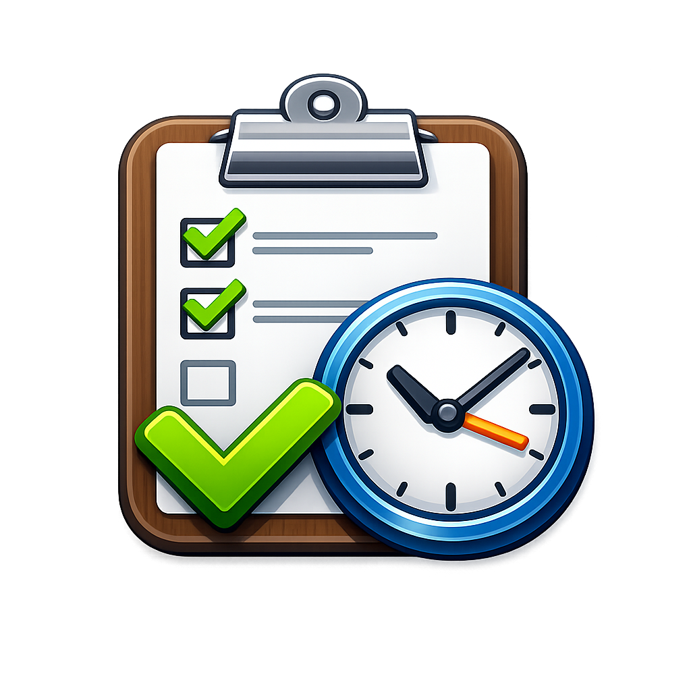

<div align="center">



# Hours Tracker

Local-first macOS hours tracker with a dark timeline UI and AI-generated end-of-day reports.

[](https://www.electronjs.org/)
[](https://react.dev/)
[](https://www.typescriptlang.org/)
[](https://vitejs.dev/)
[](#)
[](https://github.com/devjtv/hours-tracker/releases/latest)

</div>

---

## Features

- 🗓️ Dark timeline UI with entries grouped by day
- ⚡ Quick-add popover with project autocomplete, tasks, and tags
- 🎨 Per-task colours and reusable tags
- 💾 Local-disk storage via the Electron main process — no cloud, no account
- 🤖 AI end-of-day report generation through any OpenAI-compatible endpoint
- 🔁 In-app auto-updates via [electron-updater](https://www.electron.build/auto-update) and GitHub Releases

## Stack

`Electron` · `React` · `TypeScript` · `Vite` · `electron-builder` · `electron-updater`

## Local development

```bash
npm install
npm run dev
```

This boots the Vite dev server on `127.0.0.1:5173` and launches Electron pointed at it.

## Package for mac

```bash
npm run package:mac
```

Produces an Apple Silicon `.dmg` in `dist/`.

## Releasing a new version

Auto-updates are delivered through GitHub Releases. To cut a new version:

1. Bump `version` in `package.json` (e.g. `0.1.0` → `0.1.1`). Semver.
2. Commit, tag, push:
   ```bash
   git commit -am "Release v0.1.1"
   git tag v0.1.1
   git push && git push --tags
   ```
3. Put a `repo`-scoped GitHub token in `.env`:
   ```
   GH_TOKEN=ghp_yourTokenHere
   ```
4. Build and publish:
   ```bash
   set -a && . ./.env && set +a && npm run release:mac
   ```

This uploads the `.dmg`, `.zip`, blockmaps, and `latest-mac.yml` to a **draft** release. Edit the draft on GitHub, write release notes, and publish.

Installed apps check `latest-mac.yml` on launch, download the new `.zip` in the background, and prompt to restart once it's ready. Settings → **Check for updates** triggers the same flow manually.

> ⚠️ Auto-install reliability requires code-signing. Unsigned builds may need users to drag the new `.app` into Applications manually if Gatekeeper blocks the swap.

## AI provider notes

The Settings panel accepts any OpenAI-compatible chat completions endpoint:

| Provider | Endpoint |
| --- | --- |
| OpenAI | `https://api.openai.com/v1/chat/completions` |
| OpenRouter | `https://openrouter.ai/api/v1/chat/completions` |
| Other compatible gateways | Their chat completions URL |

For Anthropic / Gemini native request shapes, add a provider adapter in `electron/main.cjs`.

## Project layout

```
electron/   Main + preload process (storage, AI, updater, IPC)
src/        React renderer (App.tsx, styles, types)
assets/     App icon used by electron-builder
scripts/    Build helpers
```

## License

Personal project — no license declared.
